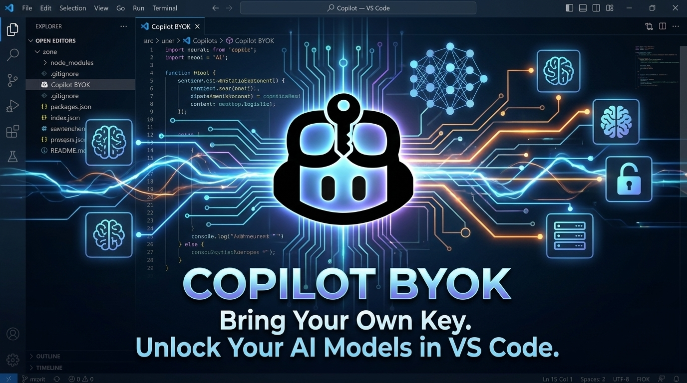

# Copilot BYOK

Add custom OpenAI and Anthropic providers to VS Code Copilot.

## Features

- Support for **OpenAI** and **Anthropic** providers
- Configure multiple providers with multiple models
- Side panel form interface for easy configuration
- Secure API key storage using VS Code's secret storage
- Model capabilities configuration (vision, tool calling, thinking)

## Requirements

- VS Code version 1.116.0 or later
- VS Code Copilot subscription active

## Usage

### Add Provider

1. Open Command Palette (`Ctrl+Shift+P`)
2. Run **Copilot BYOK: Add Provider**
3. Select provider type (OpenAI or Anthropic)
4. Enter name, base URL, and optionally API key

### Add Model

1. Run **Copilot BYOK: Add Model**
2. Select a provider
3. Enter model ID, display name, token limits, and capabilities

### Edit or Delete

- **Copilot BYOK: Edit Provider** - Update provider settings
- **Copilot BYOK: Delete Provider** - Remove a provider
- **Copilot BYOK: Edit Model** - Modify model configuration
- **Copilot BYOK: Delete Model** - Remove a model

## Extension Settings

This extension contributes the following settings:

- `copilot-byok.enable`: Enable/disable this extension
